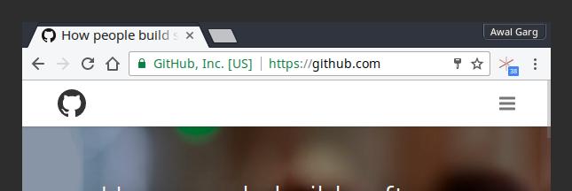
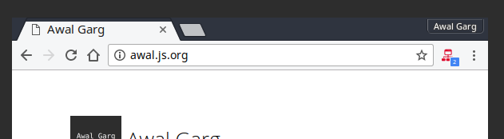

# netmonitor

**Chrome extension which shows network activity of web pages done in background after they are loaded.**

The "loading" icon for tabs in browsers only spins at first when the page is loaded. But even after that, web pages can do network IO via JavaScript in background without the user knowing. This extension highlights such network activity and shows a count of requests done till now by the page in a small indicator. It is, ofcourse, updated in real-time for each tab.

A lot of web pages use background network requests for tracking user actions and sending data to remote servers, lazily loading heavy assets etc., and all that goes unnoticed by the user. Ideally, the browsers "loading icon" should spin for those requests as well, but since it doesn't, I wrote this extension.

### Screenshots

Web page constantly making requests even after page load:

*note the hexagonal red icon and the request count*

Simple and good web page which makes two requests at load and then does nothing:

*simple network icon with request count*

### Author

Awal Garg <awalgarg@gmail.com>, [@awalGarg](https://twitter.com/awalGarg)

### License

WTFPL